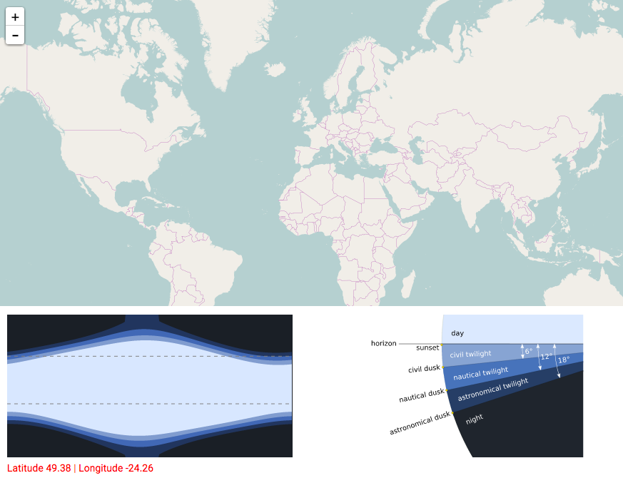
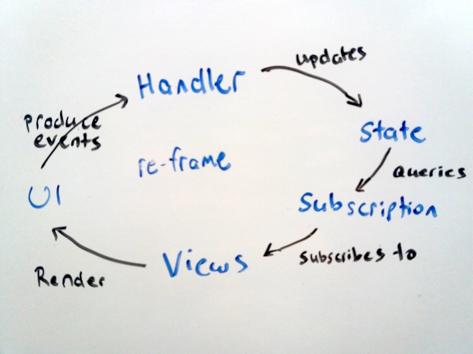

# daylight

A visualization of daylight hours throughout the year, anywhere on earth.



Try it live at http://perrygeo.test.s3.amazonaws.com/daylight/index.html

This is based on the Sunrise/Sunset algorithm published by the US Navy:
http://williams.best.vwh.net/sunrise_sunset_algorithm.htm

## Motivation

This is my first ClojureScript project and my motivation was to make a fun
product and evaluate some new technology. While I'm comfortable with the 
Clojure language, I'd never written a webapp compiled to JS. Of course there
was a whole bag of new concepts that came along with it...

After cutting my teeth on raw jquery, and knockout/angular/ember style web apps, 
the [re-frame](https://github.com/Day8/re-frame) pattern was a breath of fresh air.
No more two-way binding madness! Data flows one way and state management is radically
simplified. I probably would have felt the same way about a good ReactJS workflow but
re-frame is so well written and documented. I highly recommend reading through it even
if you plan on using a different framework or langauge. 

Here's my initial understanding sketched on the whiteboard



For the first time in my life I looked at a front-end design pattern and said "*Yeah, that works!*"

## The good

* Clojure (the language) is awesome. Pure functions and refactoring into understandable abstractions just comes naturally.
* Hiccup and Garden mean I can write css and html as data structures. A bit strange at first but I really dig it.
* figwheel and the REPL experience is great for instant feedback

    
## The bad and the ugly

While I love the concept, the implementation got a bit tricky. I'll elaborate on these at a later date

* Compilation is long (25+ seconds)
* I could not get advanced Google Closure compilation working - big negative as the resulting file size is 2.7MB without it.
* Related, working with other JS libs (leaflet) in clojurescript is not easy.
* The whole leiningen and clojure experience seems to rely a lot on scaffolding and templates.
* A bit too much magic (mostly just me not understanding *why* things work)
* Rolling svg from scratch is not fun. Made me appreciate d3.
* Haven't dived into unit tests yet...


## Bootstrapped by

```
lein new re-frame daylight +garden +re-com +routes +test +less
```

## Development Mode

### css:

```
lein garden once
# or recompile css file on change.
lein garden auto
```

### Run application:

```
lein clean
rlwarp lein figwheel dev
```

Figwheel will automatically push cljs changes to the browser.
Wait a bit, then browse to [http://localhost:3449](http://localhost:3449).


## Production Build

```
lein clean
lein cljsbuild once min
```

## TODO

Run tests:

```
lein clean
lein doo phantom test once
```

The above command assumes that you have [phantomjs](https://www.npmjs.com/package/phantomjs) installed. However, please note that [doo](https://github.com/bensu/doo) can be configured to run cljs.test in many other JS environments (chrome, ie, safari, opera, slimer, node, rhino, or nashorn). 
